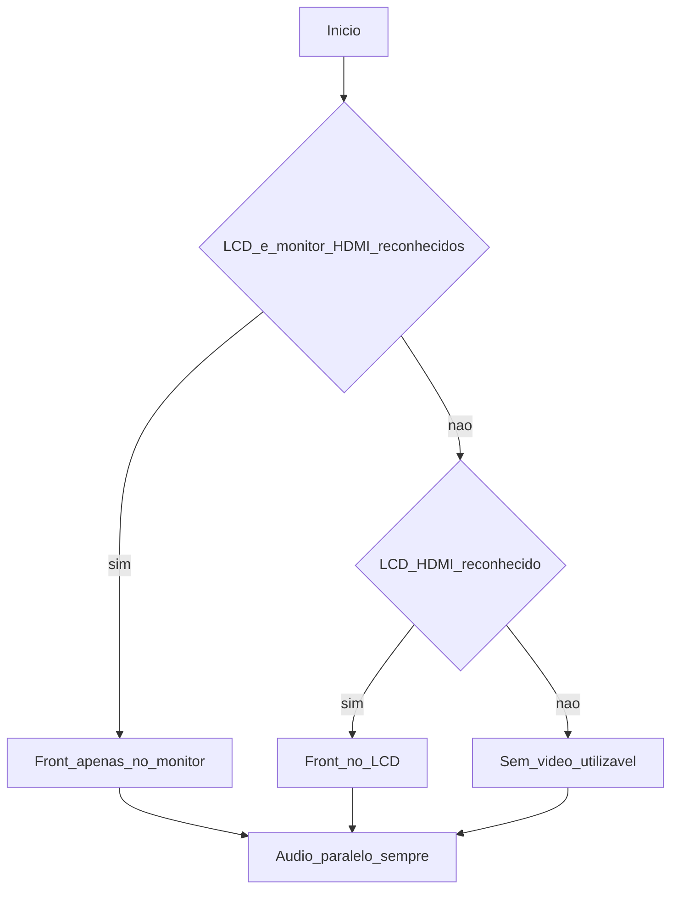

# Documento de requisitos de produto (PRD)

**Projeto:** calculadora científica acessível (hardware + software embarcado)  
**Versão do documento:** 1.4
**Status:** rascunho iterativo — evoluir junto ao TCC e à implementação  
**Referências:** [TCC.txt](TCC.txt) (texto legado de materiais/métodos e escopo de funções); [prompt-prd-raspberry.md](prompt-prd-raspberry.md) (briefing; cópia em [promptspassados/prompt-prd-raspberry.md](promptspassados/prompt-prd-raspberry.md)); [promptspassados/](promptspassados/) (prompts arquivados); planejamento temporal em [Cronograma/cronograma.md](Cronograma/cronograma.md); fluxo Git e equipe em [docs/GITHUB_WORKFLOW.md](docs/GITHUB_WORKFLOW.md); backlog operacional em [Sprints.md](Sprints.md); memória de sessão em [docs/CONTEXT.md](docs/CONTEXT.md); índice de documentação em [docs/README.md](docs/README.md); mapa de pastas do repositório em [docs/REPO_STRUCTURE.md](docs/REPO_STRUCTURE.md); Waveshare (notas + CAD) em [docs/waveshare/README.md](docs/waveshare/README.md); GPIO do Pi 4 em [docs/raspberry-pi-4b/README.md](docs/raspberry-pi-4b/README.md).

---

## 1. Resumo executivo

O produto é uma **calculadora científica** com ênfase em **acessibilidade** (feedback por voz e operação sem dependência exclusiva da tela), executada em um **Raspberry Pi 4B** integrado a teclado físico, alimentação com **UPS HAT**, **painel LCD 4,3" Waveshare** e suporte a **monitor externo via HDMI**. O núcleo de **operações matemáticas** permanece o já definido no projeto acadêmico (catálogo na seção 5).

---

## 2. Relação com o material legado (`TCC.txt`)

O arquivo [TCC.txt](TCC.txt) acompanha o trabalho acadêmico (incluindo **materiais, métodos** e o **catálogo de funções** da seção 2.5), mas **não descreve mais a arquitetura vigente** do produto. Este PRD trata apenas da calculadora baseada em **Raspberry Pi 4B**, **periféricos Waveshare** (UPS HAT + LCD 4,3"), **segunda saída HDMI** para monitor, **switches hotswap**, **PCI em fenolite dupla face 15×15 cm** (KiCad + percloreto de ferro) e do **comportamento de software** previsto aqui. A redação formal do TCC (normas, figuras, metodologia) evolui em paralelo.

---

## 3. Objetivos e modos de uso

### 3.1 Objetivos

- Fixar **baseline de hardware** e **escopo de funções** da calculadora (seção 5).
- Orientar o desenvolvimento de **software** em camadas (lógica de cálculo, interfaces visuais, áudio) sem fechar, nesta versão, cada detalhe de implementação.

### Modos de uso (visão do produto)

1. **LCD integrado** — quando apenas o painel HDMI do LCD for o contexto de saída previsto (ver seção 7), a interface adequada ao LCD é exibida nele.
2. **Monitor HDMI** — quando um monitor externo estiver disponível e reconhecido pelo sistema, a interface pensada para **maior tela** é usada no monitor (prioridade sobre o LCD quando ambos estão presentes).
3. **Áudio em paralelo** — o **áudio de feedback** (entradas na calculadora e respostas) deve permanecer **ativo de forma contínua** em segundo plano, alinhado às ações do usuário e aos resultados, para apoiar **acessibilidade** e uso com fone, **independentemente** de qual saída de vídeo estiver ativa no momento.

---

## 4. Personas e casos de uso (resumo)

| Persona / situação | Necessidade principal |
| ------------------ | --------------------- |
| **Usuários com cegueira total (100%)** | Operar com **áudio claro e contínuo** (teclas, expressão e resultado); vídeo é opcional ou indisponível conforme o contexto. |
| **Usuários com visão parcial (ex.: ~50%)** | Combinar **contraste e layout** na tela ativa (LCD ou monitor) com **reforço por voz** para reduzir erro de leitura. |
| **Professores** que acompanham alunos | Enxergar a mesma saída visual em **monitor** quando conectado, para orientar aula ou avaliação sem depender só do LCD do dispositivo. |
| **Familiares** que apoiam o uso em casa | Idem: **monitor HDMI** facilita ver o que está sendo digitado e o resultado, ao lado do feedback auditivo. |
| Uso com variação de energia | **UPS HAT** para continuidade elétrica; **avisos** (ex.: TTS com bateria baixa) quando a leitura da HAT estiver integrada; **sem** persistência obrigatória de sessão após encerramento. |

---

## 5. Escopo matemático (catálogo de funções)

Conforme a seção **2.5 — Recursos disponíveis** de [TCC.txt](TCC.txt), o produto deve suportar pelo menos:

### Funções trigonométricas

- **Seno** (`sen`)
  - **Arco-seno** (`sen⁻¹`)

- **Cosseno** (`cos`)
  - **Arco-cosseno** (`cos⁻¹`)

- **Tangente** (`tan`)
  - **Arco-tangente** (`tan⁻¹`)

---

### Funções logarítmicas

- **Logaritmo decimal** (`log`)
  - **Logaritmo natural** (`ln`)

---

### Constantes matemáticas

- Constante de Euler (`e`)
- Constante pi (`π`)

---

### Operações algébricas

- Exponenciação (`xʸ` ou `^`)
- Raiz quadrada (`√`)
- Inversão de valor (`x⁻¹`)
- Fatorial (`x!`)

---

### Operações combinatórias

- **Combinação** (`nCr`)
  - **Permutação** (`nPr`)

---

### Conversões de coordenadas

- Conversão coordenada **polar → retangular**
  - Conversão coordenada **retangular → polar**

---

### Controle e manipulação de entrada

- Operador deletar (`DEL`)
- Limpar / retornar ao valor anterior (`AC`)
- Resposta anterior (`Ans`)

---

### Estrutura de expressão

- Parênteses de agrupamento:
  - `(`
  - `)`

- Separadores numéricos:
  - Vírgula (`,`)
  - Ponto decimal (`.`)

---

### Operações aritméticas básicas

- Soma (`+`)
- Subtração (`−`)
- Multiplicação (`×`)
- Divisão (`÷`)

---

**Requisito:** a **lógica de cálculo** do sistema deve produzir resultados **consistentes** com esse catálogo; regras de precedência, formato numérico e tratamento de erros seguem a **seção 13** (códigos e feedback). Definições formais de cada função (domínio no plano real, convenções de ângulo graus/radianos se aplicável) permanecem **alinhadas ao texto acadêmico** em [TCC.txt](TCC.txt) §2.5 — não é necessário repetir no PRD uma especificação matemática longa, desde que o comportamento implementado seja o mesmo.

Funções descritas em níveis aninhados representam operações alternativas associadas ao mesmo botão físico/lógico, sendo executadas quando o estado `Ctrl` estiver definido como `true`.
### 5.1 Quanto detalhar a seção 5 (sem fugir do escopo)

| Abordagem | Quando usar |
| --------- | ----------- |
| **Manter o catálogo como lista** (estado atual) | Suficiente para o PRD orientar produto e RF; o TCC continua a ser a referência normativa das funções. |
| **Notas curtas só onde há ambiguidade** | Ex.: ordem de operações, separador decimal, modo **graus vs radianos** se o `TCC.txt` já fixar — copiar **uma frase** ou remeter ao parágrafo do TCC, **sem** acrescentar operações novas. |
| **Documento técnico à parte** (opcional) | Tabela “função → domínio → erro padrão” para implementação e testes — continua **subconjunto** do catálogo §5, não expansão de escopo. |

**Regra:** qualquer detalhe novo no PRD deve ser **restrito a clareza e testabilidade**; **não** introduzir funções ou modos de cálculo que não estejam no TCC §2.5 salvo revisão explícita do trabalho acadêmico.

---

## 6. Arquitetura de hardware (alto nível)

| Componente | Papel |
| ---------- | ----- |
| Raspberry Pi 4B | SBC principal: SO, aplicação, áudio, vídeo. |
| Waveshare UPS HAT | Continuidade elétrica; leitura de carga por **I2C** (ver [docs/waveshare/UPS_HAT.md](docs/waveshare/UPS_HAT.md)); **avisos** (ex.: **TTS** com bateria baixa) quando implementado; **sem** exigência de persistência de sessão após encerramento. |
| LCD Waveshare **4,3" HDMI (B)** | Painel local; **modelo, cablagem e `config.txt`** em [docs/waveshare/4.3inch_HDMI_LCD_B.md](docs/waveshare/4.3inch_HDMI_LCD_B.md). **Interruptor físico** no encapsulamento (com **Braille** no exterior) desliga a **saída HDMI** para o LCD; o painel entra em **standby** conforme o circuito. |
| Monitor HDMI externo | Segunda saída HDMI; quando em uso, torna-se a saída visual principal com **front dedicado**. |
| Teclado físico | **Cherry MX Red** em **hotswap**; trilhas na **fenolite**; **barra de pinos** + **cabo flat** até aos **GPIO** do Pi para matriz **6×7**. **Lista de GPIOs e funções** por documento de hardware (a acrescentar). |
| Identificação **Braille** | Peças em **PLA** (impressão **Bambu Lab A1**); notação **Braille português (BR)** segundo **normas oficiais** (rótulos no interruptor / teclas conforme desenho). |
| PCI | **Fenolite**, **dupla face**, **15×15 cm**; esquemático e layout no **KiCad**; produção por corrosão com **percloreto de ferro**. |

**Pendência de cablagem (vídeo):** qual **saída HDMI** do Raspberry Pi 4B liga ao **LCD** e qual ao **monitor externo** fica registada no **esquemático** / testes — o PRD assume **duas** saídas HDMI e detecção pelo SO.

---

## 7. Saída de vídeo e áudio (requisitos centrais)

Não há uma única “imagem principal” fixa: a saída visível depende do que o Raspberry **reconhece** nas portas HDMI e do estado do **interruptor físico** do LCD.

### 7.0 Interruptor físico do LCD

- O **interruptor** corta a **saída HDMI** destinada ao LCD; o painel permanece em **standby** (comportamento elétrico conforme desenho).
- O **lado exterior** do encapsulamento junto ao interruptor inclui **Braille** para identificação tátil.
- Para efeitos de **RF-04** (modo somente áudio), com o LCD neste estado o sistema trata como **ausência de vídeo utilizável no LCD**, mantendo o **áudio** e o **catálogo** de operações.

### 7.1 Apenas o HDMI do LCD reconhecido

- A interface visual adequada ao **LCD 4,3"** é exibida **somente** nesse painel (front-end do LCD).

### 7.2 HDMI do LCD e HDMI do monitor reconhecidos ao mesmo tempo

- A interface visual é exibida **apenas no monitor externo** (front-end do monitor), que é a saída **preferencial**.
- O LCD **não** deve apresentar a mesma interface principal (desligar backlight, desativar saída ou equivalente — detalhe de implementação).

### 7.3 Áudio em paralelo (sempre)

- Em **qualquer** combinação de saídas de vídeo acima, o **áudio de feedback** continua **ativo em paralelo**, anunciando entradas e resultados de forma alinhada à calculadora (fone de ouvido).
- Se **não** houver saída visual utilizável, a operação permanece possível **apoiada no áudio**, mantendo o mesmo requisito de clareza (ver seção 8).

### 7.4 Fluxo lógico (referência)

---

## 8. Software (alto nível)

- **Motor de cálculo:** a **lógica matemática** da secção 5 (parser, precedência, funções, erros) será implementada preferencialmente em **Python**; é **uma** base de regras partilhada e as **interfaces** apenas consomem o estado (expressão, resultado, mensagens), **sem** o núcleo depender da stack de UI dos fronts.

- **Dois front-ends visuais distintos:** um projeto para as **restrições do LCD** (tamanho, legibilidade, toque/teclas físicas) e outro para o **monitor HDMI** (maior área, layout mais rico). Apenas **um** deles exibe a UI principal por vez, conforme a seção 7.

- **Áudio:** deve ser **funcional e compreensível** — o usuário precisa **entender claramente** o que é falado (teclas, confirmações, resultados). A escolha da solução (motor TTS, voz, velocidade, pausas, eventual uso de sons curtos de apoio) deve priorizar **inteligibilidade** e uso **offline**, dentro do que o Raspberry Pi 4B suportar bem. **Idioma da voz:** **português (Brasil)**.

**Detecção de HDMI:** depende de SO e driver; detalhes técnicos permanecem em **itens em aberto** até testes no hardware.

**Organização de código:** mantém-se a ideia de módulos separados (equivalente conceitual a `core`, interfaces e `accessibility` citados em [TCC.txt](TCC.txt), seção 2.6), **sem** amarrar o PRD a frameworks legados do texto acadêmico.

---

## 9. Requisitos funcionais

| ID | Requisito |
| -- | --------- |
| RF-01 | Executar localmente no Raspberry Pi 4B todas as operações listadas na seção 5. |
| RF-02 | Alternar automaticamente entre **UI no LCD** e **UI no monitor HDMI** quando o monitor externo for conectado ou removido (política de debounce e detecção a especificar). O **interruptor físico** do LCD (§7.0) coloca o painel em **standby** e implica **ausência de vídeo utilizável** nesse painel. |
| RF-03 | Ao usar monitor HDMI como saída principal, **não** exigir o LCD como superfície obrigatória (LCD desligado ou ocioso conforme RF-02). |
| RF-04 | Operar em **modo somente áudio** quando o display estiver desligado ou indisponível, anunciando entradas e resultados por TTS. |
| RF-05 | Aceitar entrada exclusivamente pelo **teclado físico** do produto (mapeamento de teclas documentado). |
| RF-06 | Integrar **UPS HAT**: quando a leitura de carga estiver disponível (**I2C** / documentação Waveshare), **avisar por TTS** se a **bateria estiver baixa** (limiar a calibrar). **Não** há persistência obrigatória de sessão nem de trabalho do utilizador após **encerramento**; perda súbita de rede elétrica não exige recuperação de ficheiros de utilizador. |
| RF-07 | Comunicar falhas e **erros de domínio** da calculadora de forma **coerente** na **UI ativa** e no **áudio**, segundo **códigos, prioridade e modelos de mensagem** da **seção 13** (o texto exato do TTS pode variar desde que preserve o **mesmo código** e significado). |
| RF-08 | A **entrada por teclado** não pode ficar **bloqueada de forma prolongada** enquanto o TTS falar; deve existir política de **fila** ou **interrupção** resumida dos anúncios (detalhes deixados à implementação e à §12 quando necessário). |
| RF-09 | Após **reconexão** de HDMI ou mudança equivalente no estado de vídeo, o modo de **UI principal** deve **restabelecer-se** sem exigir **reinício manual** da aplicação (sujeito a limites do SO e drivers em §12). |
| RF-10 | Em **modo somente áudio**, manter o **mesmo conjunto de operações** da secção 5 que em modo com vídeo, **sem** reduzir o catálogo matemático. |
| RF-11 | O teclado físico deve aplicar **debounce** (ou mecanismo equivalente) para **reduzir** entradas **duplicadas** não intencionais (tempos a calibrar com o hardware). |
| RF-12 | Quando houver **vídeo ativo**, a UI deve oferecer **contraste** e **tamanho mínimo de tipografia** adequados a pessoas com **visão parcial** (métricas concretas em §12 ou guia de UI). |
| RF-13 | **Ans** e **último resultado** aplicam-se à **sessão de uso em curso**; **sem** persistência obrigatória entre **encerramentos** do dispositivo (alinhado ao RF-06). |
| RF-14 | Quando os dados estiverem **disponíveis** via **UPS HAT**, informar **alimentação externa** versus **bateria** por canal **visual e/ou áudio** (inclui aviso de **carga baixa** em coerência com o RF-06). |

---

## 10. Requisitos não funcionais

| ID | Requisito |
| -- | --------- |
| RNF-01 | **Desempenho:** resposta perceptível ao usuário em até ~500 ms para operações típicas após soltar tecla (ajustar após medição). |
| RNF-02 | **Áudio:** latência de TTS aceitável para uso interativo; funcionamento **offline** (sem dependência de nuvem para voz). |
| RNF-03 | **Confiabilidade:** recuperação razoável após hotplug de HDMI (sem travar o aplicativo de forma permanente). |
| RNF-04 | **Manutenção:** código versionado (ex.: Git/GitHub) e estrutura modular (core / UI / accessibility). |
| RNF-05 | **Persistência opcional:** se no futuro existir guardação local de estado, ficheiros inválidos ou corrompidos devem permitir **degradação segura** (ex.: arranque com estado limpo) **sem** impedir o uso do dispositivo — **não** integra a baseline atual (ver RF-13). |
| RNF-06 | **Arranque:** minimizar o **tempo até o sistema estar utilizável** após alimentação (requisito de produto); SO e stack (§12) escolhidos devem suportar esse objetivo — **meta numérica** após medição no hardware. |

---

## 11. Riscos e dependências

- **Hotplug HDMI no Linux:** eventos de conexão e nomes de saídas (`HDMI-A-1`, `HDMI-A-2`) variam; pode exigir `udev`, `libdrm` ou camadas do compositor.
- **Driver e modo do LCD Waveshare:** seguir [docs/waveshare/4.3inch_HDMI_LCD_B.md](docs/waveshare/4.3inch_HDMI_LCD_B.md); alterações de SO podem exigir revisão de `config.txt` / firmware.
- **Sincronização UI + áudio:** evitar anúncios duplicados ou fora de ordem ao trocar de modo.
- **Fabricação em fenolite:** tolerâncias e corrosão caseira afetam confiabilidade da PCI; revisão de largura de trilha/isolamento no KiCad.
- **Bateria e UPS:** autonomia limitada; **avisos** por TTS conforme RF-06; **sem** política de backup de sessão na baseline.

---

## 12. Itens em aberto / perguntas ao autor

- **SO e arranque:** decidir entre **Raspberry Pi OS Lite** (e variantes) e/ou **imagem Buildroot**; **boot rápido** no início da sessão é **requisito de produto** a quantificar por medição e a cruzar com a stack de UI escolhida.
- **Stack dos front-ends** (LCD e monitor HDMI): ainda por definir (ex.: Qt, GTK, Electron, web local em kiosk, etc.), compatível com o SO escolhido.
- **Compositor / sessão gráfica** (se Pi OS): **Wayland** vs **X11** — impacto em detecção HDMI, rendimento e arranque.
- **Mapeamento GPIO do teclado (matriz 6×7):**
    - **Rows (Linhas):** Row0: GPIO26, Row1: GPIO32, Row2: GPIO26, Row3: GPIO18, Row4: GPIO24, Row5: GPIO33.
    - **Cols (Colunas):** Col0: GPIO12, Col1: GPIO16, Col2: GPIO15, Col3: GPIO19, Col4: GPIO23, Col5: GPIO29, Col6: GPIO31.
- **UPS HAT:** Utiliza barramento **I2C** (SDA/SCL padrão do Raspberry Pi).
- **Limiares** de software: percentagem ou tensão mínima para **“bateria baixa”** (TTS) e tempos de **debounce** do teclado — calibrar com hardware real.

**Decisões já registadas (não reabrir aqui):** modelo LCD **4,3" HDMI (B)** Waveshare em `docs/waveshare/`; **interruptor físico** do LCD com **Braille** no encapsulamento; **Braille PT-BR** em **PLA** (Bambu Lab A1); teclado **Cherry MX Red** + **hotswap** + **flat** para GPIO **sem** MCU intermédio; **motor de cálculo em Python**; **TTS em português (Brasil)** via **`espeak-ng`** (o `espeak` clássico é incompatível com o `pyttsx3`); UPS com **aviso de carga**, **sem** persistência obrigatória de sessão.

---

## 13. Erros, códigos e feedback (visual + TTS)

Esta seção **padroniza** como o aplicativo classifica falhas e como as comunica na **UI ativa** (LCD ou monitor) e no **TTS**, em coerência com **RF-07**, **RF-04** e **RF-06**.

### 13.1 Convenções gerais

| Elemento | Regra |
| -------- | ----- |
| **Código** | Identificador estável `ERR-xxx` ou `WRN-xxx` (três dígitos). Útil para testes, logs e documentação. |
| **Prioridade** | **P1** — bloqueia resultado até o usuário corrigir ou limpar; **P2** — aviso; operação pode continuar após o anúncio. |
| **Visual (com vídeo)** | **Faixa ou toast** com **código curto** + **mensagem em português**; **contraste** mínimo alinhado a **RF-12**; para **P1**, realçar estado de **erro** (ex.: contorno ou ícone de alerta — detalhe de implementação). |
| **TTS** | **Sempre** que o erro afetar o resultado ou a ação atual (P1), e **recomendado** para P2 quando houver áudio ativo. Em **modo só áudio** (**RF-04**), o TTS é o canal **principal** para P1 e P2. |
| **Modelo de frase (TTS)** | `[Código]. [Descrição breve]. [Sugestão de correção opcional].` — voz **pt-BR**; evitar mensagens excessivamente longas (ver **RF-08**). |
| **Fila / interrupção** | Erros **P1** devem poder **interromper ou preceder** anúncios de menor prioridade na fila de TTS, para não atrasar o feedback crítico. |
| **Consistência** | O **mesmo** `ERR-xxx` deve produzir a **mesma** categoria visual (tipo de alerta) e o **mesmo** significado no TTS, em LCD e em monitor. |

### 13.2 Tabela de erros e avisos (baseline)

Categorias abrangem **cálculo**, **entrada**, **sistema** e **energia**. Textos TTS são **modelo** — podem ser ligeiramente reformulados desde que mantenham código e sentido.

| Código | Origem | Prioridade | Feedback visual (se houver vídeo) | Modelo TTS (pt-BR) |
| ------ | ------ | ---------- | ----------------------------------- | ------------------- |
| **ERR-001** | Divisão por zero ou expressão equivalente | P1 | Faixa/área de erro: código + «Divisão por zero» | «Erro 001. Divisão por zero. Limpe ou altere a expressão.» |
| **ERR-002** | Argumento fora do domínio (ex.: raiz par de número negativo, log ou ln de valor não positivo) | P1 | «Argumento inválido para a função» + código | «Erro 002. Argumento inválido para esta função. Verifique o sinal e o domínio.» |
| **ERR-003** | Função inversa / trig. com valor fora do intervalo (ex.: arco-seno ou arco-cosseno) | P1 | «Valor fora do domínio» + código | «Erro 003. Valor fora do domínio da função.» |
| **ERR-004** | **nCr** / **nPr** com *n* < *r*, negativos ou não inteiros (conforme regra do motor) | P1 | «Combinação ou permutação inválida» + código | «Erro 004. Parâmetros inválidos para combinação ou permutação.» |
| **ERR-005** | Fatorial com argumento inválido (negativo ou não inteiro, conforme regra do motor) | P1 | «Fatorial inválido» + código | «Erro 005. Fatorial não definido para este valor.» |
| **ERR-006** | Overflow / resultado não representável | P1 | «Resultado muito grande» (ou equivalente) + código | «Erro 006. Resultado muito grande ou não representável.» |
| **ERR-007** | Expressão **sintaticamente** inválida (parênteses, operadores, vírgulas) | P1 | «Expressão inválida» + código | «Erro 007. Expressão inválida. Verifique parênteses e operadores.» |
| **ERR-008** | Entrada incompleta ao pedir avaliação (= ou equivalente) | P2 | Indicador discreto «Expressão incompleta» | «Aviso 008. Expressão incompleta.» |
| **ERR-009** | Conversão polar ↔ rectangular com dados insuficientes ou inválidos | P1 | «Erro na conversão» + código | «Erro 009. Dados insuficientes ou inválidos para a conversão.» |
| **WRN-010** | **Ans** indisponível (ex.: primeira operação da sessão) | P2 | Mensagem curta «Sem resposta anterior» | «Aviso 010. Não há resposta anterior.» |
| **WRN-011** | Motor TTS indisponível ou falha pontual | P2 | Ícone ou texto «Áudio indisponível» | *Silêncio ou beep opcional*; log do sistema; **não** bloquear entrada (ver **RF-08**). |
| **WRN-012** | HDMI / vídeo: mudança de estado ou ausência temporária | P2 | *N/A* se só áudio | «Aviso 012. Saída de vídeo alterada.» — apenas se política de produto exigir anúncio. |
| **WRN-020** | Bateria **baixa** (UPS, quando integrado) | P2 | Indicador de bateria + mensagem «Bateria baixa» | «Aviso 020. Bateria baixa. Ligue à corrente quando possível.» (alinhado a **RF-06** / **RF-14**). |
| **WRN-021** | Alimentação na **bateria** (informativo, opcional) | P2 | Indicador «Na bateria» | *Opcional:* «Usando alimentação por bateria.» |

### 13.3 Extensão da tabela

Novos códigos **ERR-0xx** / **WRN-0xx** livres devem ser **registrados nesta seção** ao aparecerem na implementação ou em testes, **sem** alterar o catálogo matemático da **seção 5** salvo decisão explícita no TCC.

---

## 14. Histórico de revisões

| Versão | Data | Notas |
| ------ | ---- | ----- |
| 0.1 | 2026-04-13 | PRD inicial a partir do briefing; escopo matemático importado da seção 2.5 do `TCC.txt`. |
| 1.1 | 2026-04-13 | Seções 2–8: remoção de referências à arquitetura legada; modos de uso (LCD, HDMI, áudio paralelo); personas (cegueira total, visão parcial, professores, familiares); matriz 7×7 e HDMI a confirmar; regra de vídeo por reconhecimento HDMI; dois front-ends; áudio priorizando clareza. |
| 1.2 | 2026-04-17 | Secção 9: novos RF-07 a RF-14 (erros, TTS vs entrada, reconexão HDMI, modo só áudio, debounce, legibilidade, Ans/persistência, indicação externa/bateria UPS). Secção 10: RNF-05 (persistência segura). Versão do documento atualizada para 1.2. |
| 1.3 | 2026-04-17 | Secção 6–8: LCD (B) documentado, interruptor HDMI/standby + Braille, teclado MX Red/flat/GPIO, motor Python, TTS pt-BR; §7.0 interruptor; RF-06/13/14 e RNF-05 alinhados a “sem persistência” + aviso UPS; RNF-06 boot rápido; §12 reduzida (SO/boot, stack UI, GPIO list, limiares); `promptspassados/` com prompts arquivados. Versão 1.3. |
| 1.4 | 2026-04-18 | §5.1 orientação sobre detalhamento sem expandir escopo; §13 nova: padronização de erros (códigos ERR/WRN, prioridade P1/P2, visual, TTS, fila); tabela baseline; RF-07 e requisito da §5 apontam para §13; histórico em §14. Versão 1.4. |
