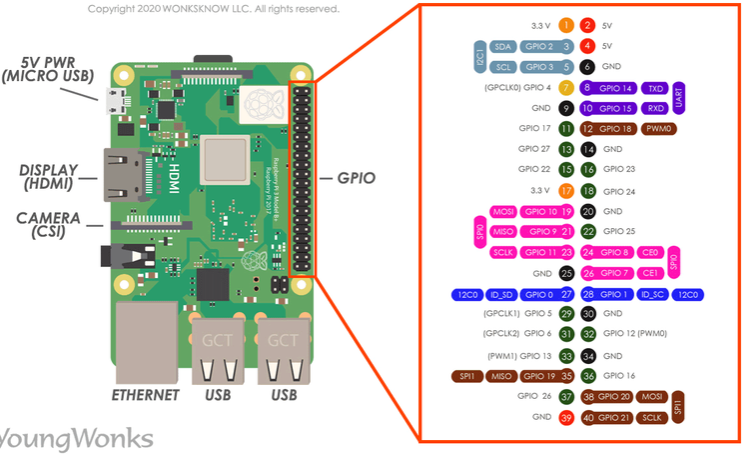

# Especificação do pinout — Raspberry Pi 4 Model B (header J8)

**Conector:** J8, **40 pinos** (2×20), passo **2,54 mm**.  
**Âmbito:** apenas pinagem e funções de **uso corrente** no header; não substitui o [datasheet oficial](../RP-008341-DS-1-raspberry-pi-4-datasheet.pdf) para limites absolutos de corrente, derivações do SoC nem diagramas de bloco.

**Referências externas:** [pinout.xyz](https://pinout.xyz/) · [Documentação Raspberry Pi](https://www.raspberrypi.com/documentation/)

---

## 1. Convenções

| Termo | Significado |
| ----- | ----------- |
| **Pin** | Número **físico** no conector, **1…40** (estampado na silkbscreen da PCB como “1” junto ao canto da placa). |
| **BCM** | Numeração **Broadcom** do GPIO (uso típico em `gpiozero`, `RPi.GPIO`, `libgpiod`, overlays). |
| **Nome** | Rótulo habitual no **modo GPIO**; entre parêntesis, **função alternativa** mais citada para periféricos. |

**Orientação física:** com a placa vista de cima e os **conectores USB/Ethernet para baixo**, a coluna ímpar (**1, 3, …, 39**) fica em geral **perto da borda** da board; o **pino 1** é o canto que leva **3,3 V** (quadrado na PCB em muitos desenhos). Confirme sempre o **“1”** na sua unidade.

---

## 2. Requisitos elétricos (resumo)

- Todos os pinos marcados como **GPIO** operam a **3,3 V** lógicos. **Não** aplicar **5 V** a entradas GPIO — **não** são tolerantes a 5 V.
- Pinos **3V3** (1, 17): alimentação **3,3 V** limitada (capacidade total partilhada; ver datasheet).
- Pinos **5V** (2, 4): **5 V** (ligados ao rail de alimentação; origem depende do modo de alimentação da placa).
- **GND** (6, 9, 14, 20, 25, 30, 34, 39): referência comum.
- Corrente máxima **por GPIO** e **soma** de I/O: ver **datasheet** e notas de hardware; não assumir carga forte sem transistor/driver.

---

## 3. Tabela de pinos J8 (especificação)

| Pin | Sinal / função principal | BCM | Tipo |
| --- | ------------------------ | --- | ---- |
| 1 | 3V3 | — | Alimentação |
| 2 | 5V | — | Alimentação |
| 3 | GPIO2 — **I2C1 SDA** | 2 | GPIO / I2C |
| 4 | 5V | — | Alimentação |
| 5 | GPIO3 — **I2C1 SCL** | 3 | GPIO / I2C |
| 6 | GND | — | Terra |
| 7 | GPIO4 | 4 | GPIO |
| 8 | GPIO14 — **UART0 TXD** | 14 | GPIO / UART |
| 9 | GND | — | Terra |
| 10 | GPIO15 — **UART0 RXD** | 15 | GPIO / UART |
| 11 | GPIO17 — **SPI1 CE1** (ALT) | 17 | GPIO / SPI |
| 12 | GPIO18 — **SPI1 SCLK** (ALT) / **PWM0** / PCM_CLK | 18 | GPIO / SPI / PWM / PCM |
| 13 | GPIO27 | 27 | GPIO |
| 14 | GND | — | Terra |
| 15 | GPIO22 | 22 | GPIO |
| 16 | GPIO23 | 23 | GPIO |
| 17 | 3V3 | — | Alimentação |
| 18 | GPIO24 | 24 | GPIO |
| 19 | GPIO10 — **SPI0 MOSI** | 10 | GPIO / SPI |
| 20 | GND | — | Terra |
| 21 | GPIO9 — **SPI0 MISO** | 9 | GPIO / SPI |
| 22 | GPIO25 | 25 | GPIO |
| 23 | GPIO11 — **SPI0 SCLK** | 11 | GPIO / SPI |
| 24 | GPIO8 — **SPI0 CE0** | 8 | GPIO / SPI |
| 25 | GND | — | Terra |
| 26 | GPIO7 — **SPI0 CE1** | 7 | GPIO / SPI |
| 27 | GPIO0 — **ID_SD** (EEPROM HAT, I2C) | 0 | Reservado HAT / GPIO |
| 28 | GPIO1 — **ID_SC** (EEPROM HAT, I2C) | 1 | Reservado HAT / GPIO |
| 29 | GPIO5 | 5 | GPIO |
| 30 | GND | — | Terra |
| 31 | GPIO6 | 6 | GPIO |
| 32 | GPIO12 — **PWM0** | 12 | GPIO / PWM |
| 33 | GPIO13 — **PWM1** | 13 | GPIO / PWM |
| 34 | GND | — | Terra |
| 35 | GPIO19 — **SPI1 MISO** (ALT) / PCM_FS | 19 | GPIO / SPI / PCM |
| 36 | GPIO16 — **SPI1 CE0** (ALT) | 16 | GPIO / SPI |
| 37 | GPIO26 | 26 | GPIO |
| 38 | GPIO20 — **SPI1 MOSI** (ALT) / PCM_DIN | 20 | GPIO / SPI / PCM |
| 39 | GND | — | Terra |
| 40 | GPIO21 — PCM_DOUT (ALT) | 21 | GPIO / PCM |

**Nota:** **SPI1** só está disponível após ativar o controlador com **Device Tree overlay** (ex.: `spi1-1cs`, `spi1-2cs`, `spi1-3cs` em `config.txt`). Os pinos **MOSI / MISO / SCLK** acima são o mapeamento habitual no header; linhas **CE** (**chip enable** = **chip select**, **CS**) podem ser **reatribuídas** por parâmetros do overlay — ver README em `/boot/firmware/overlays/README` na imagem do SO.

---

## 3.1 SPI0 — sinais no J8 (bus principal)

Controlador **SPI0** (nós típicos `/dev/spidev0.0`, `/dev/spidev0.1`). **CE** = *chip enable* (sinônimo usual de **CS**, *chip select* / **SS**, *slave select*).

| Sinal | Função | BCM | Pin físico |
| ----- | ------ | --- | ---------- |
| **MOSI** | Master Out, Slave In | 10 | 19 |
| **MISO** | Master In, Slave Out | 9 | 21 |
| **SCLK** | *Serial clock* (relógio SPI) | 11 | 23 |
| **CE0** | Chip select 0 | 8 | 24 |
| **CE1** | Chip select 1 | 7 | 26 |

O SPI0 expõe **duas** linhas de chip select (**CE0**, **CE1**). Não há **CE2** no SPI0 neste header.

---

## 3.2 SPI1 — sinais habituais no J8 (bus auxiliar)

Controlador **SPI1** (ex.: `/dev/spidev1.x` quando ativo). Mapeamento **frequente** no conector (compatível com referências como [pinout.xyz — SPI](https://pinout.xyz/pinout/spi)); **confirmar** na sua imagem se usou overlay com `cs*_pin` personalizado.

| Sinal | BCM | Pin físico |
| ----- | --- | ---------- |
| **MOSI** | 20 | 38 |
| **MISO** | 19 | 35 |
| **SCLK** | 18 | 12 |
| **CE0** | 16 | 36 |
| **CE1** | 17 | 11 |

**CE2 (terceiro chip select):** o overlay **`spi1-3cs`** permite três linhas **CS**; os **números de GPIO** para **CS0 / CS1 / CS2** são **configuráveis** (parâmetros `cs0_pin`, `cs1_pin`, `cs2_pin` no README oficial dos overlays). O valor **padrão** do firmware pode **colidir** com o uso “didático” CE0 = pin 36 se não ler o overlay — **sempre** validar com a documentação da sua versão (`dtoverlay -h spi1-3cs` ou arquivo `README` dos overlays). O **GPIO21** (pin **40**) **não** faz parte deste mapa SPI1 habitual; mantém-se principalmente como **PCM** / GPIO.

---

## 4. Interfaces no header (mapa rápido)

| Interface | Pinos físicos | BCM |
| --------- | ------------- | --- |
| **I2C1** (uso geral, ex.: sensores, muitos HAT) | 3 (SDA), 5 (SCL) | 2, 3 |
| **UART0** | 8 (TX), 10 (RX) | 14, 15 |
| **SPI0** | 19 (**MOSI**), 21 (**MISO**), 23 (**SCLK**), 24 (**CE0**), 26 (**CE1**) | 10, 9, 11, 8, 7 |
| **SPI1** (com overlay) | 38 (**MOSI**), 35 (**MISO**), 12 (**SCLK**), 36 (**CE0**), 11 (**CE1**); **CE2** só com `spi1-3cs` e pinos conforme overlay | 20, 19, 18, 16, 17 |
| **EEPROM HAT** (I2C dedicado) | 27 (ID_SD), 28 (ID_SC) | 0, 1 |

No **Raspberry Pi 4** existem **UARTs adicionais** noutros pinos via configuração; não estão todas listadas nesta especificação resumida.

---

## 5. EEPROM de HAT (pinos 27 e 28)

Os pinos **27** e **28** estão ligados ao bus de **identificação de HAT** (EEPROM). Com **UPS HAT**, **Sense HAT** ou outras placas empilhadas que usem esse bus, **não** atribua estes pinos a **matriz de teclado** ou GPIO geral **sem** analisar **conflito elétrico e lógico** com a pilha de placas.

---

## 6. Diagrama visual

A imagem `Pinout.png` serve como **referência gráfica**. Pode corresponder a outro modelo no silkscreen (ex.: Pi 3 B+); a **numeração 1…40** e as **funções da tabela acima** aplicam-se ao **Pi 4 Model B** neste projeto.

---

## 7. Artefactos relacionados no repositório

- [README.md](README.md) — índice da pasta (datasheet, CAD, links).
- Modelo 3D: [`../cad/raspberry-pi-4-model-b/`](../cad/raspberry-pi-4-model-b/)
